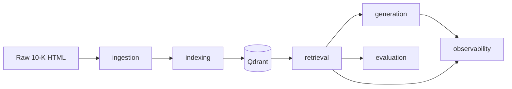

# High-Level Design (HLD)

## 1. Problem

Answer natural-language questions over **SEC 10-K filings** for Apple, Microsoft, and Tesla with:

- Grounded, **citation-backed** answers
- Company-scoped (and later cross-company) retrieval
- Measurable retrieval quality
- Production engineering practices (config, logging, tests, observability)

This is not a chatbot toy. It is a portfolio-grade Advanced RAG system.

## 2. Solution shape

A **staged offline + online pipeline**:

| Stage | When | Job |
|---|---|---|
| **Ingestion** | Offline / batch | HTML → cleaned text → chunked `Document`s |
| **Indexing** | Offline / batch | Embed + upsert into Qdrant |
| **Retrieval** | Online | Query → ranked context chunks |
| **Generation** | Online | Context + prompt → cited answer |
| **Evaluation** | Offline / CI | Score retrievers/chains against a fixed set |
| **Observability** | Online | Trace runs in LangSmith (optional) |

## 3. Component responsibilities

### 3.1 `ingestion`

Owns the messy world of SEC HTML (inline XBRL, scripts, tables). Emits LangChain `Document` objects with metadata the rest of the system relies on (`company`, `chunk_id`, `source`).

**Why separate:** Parsing and chunking change often; retrieval must not care how HTML was cleaned.

### 3.2 `indexing`

Owns embedding model calls and Qdrant collection lifecycle. Batch, write-path only.

**Why separate:** Write path (API keys, batch size, upsert semantics) must not pollute the hot read path.

### 3.3 `retrieval`

Owns *finding* context: dense, sparse, hybrid (RRF), filters, rerank. All strategies implement the same retriever interface so evaluation stays fair.

### 3.4 `generation`

Owns prompts, context assembly, LLM calls, citation formatting.

### 3.5 `evaluation`

Owns metrics and the harness. **Never** owns retrieval strategy details.

### 3.6 `observability`

Owns LangSmith wiring. Tracing is optional — the system must run without a LangSmith account.

### 3.7 `config` / `core`

Typed settings; logging; exception hierarchy. No RAG semantics.

## 4. External systems

| System | Role | Local default |
|---|---|---|
| **Qdrant** | Vector store + payload filters | `docker compose` on `:6333` |
| **OpenAI** | Embeddings (+ later chat) | API key in `.env` |
| **LangSmith** | Traces / datasets (optional) | Off by default |

## 5. Non-goals (for now)

- Live SEC EDGAR crawling (we ship three fixed filings)
- Multi-tenant auth
- Real-time streaming ingestion
- Perfect table reconstruction (known hard problem; tracked as a failure mode)

## 6. Quality attributes

| Attribute | How we pursue it |
|---|---|
| **Correctness** | Eval harness + audited hits, not vibes |
| **Explainability** | Citations + LangSmith traces |
| **Maintainability** | One-way imports, ADRs, package docs |
| **Testability** | Unit tests without live APIs; integration marked |
| **Operability** | JSON logs, typed config, fail-fast errors |

## 7. Major trade-offs (summary)

| Choice | Alternative | Why we chose this |
|---|---|---|
| LangChain orchestration | Raw OpenAI + DIY | Interfaces + LCEL + LangSmith; still own RAG design |
| Qdrant | Chroma / Pinecone | Local Docker, hybrid, filters, resume-grade |
| Single collection + filter | Per-company collections | Flexible query-time scoping |
| Incremental deps | Install everything day one | Honest dependency graph |
| Filings in git | Download script / LFS | Simplest reproducibility for ~12MB |

Deep dives live in [`docs/adr/`](adr/).

## 8. Evolution path

1. Dense retrieval baseline → measure
2. Hybrid + rerank → measure
3. Generation + citations → measure faithfulness
4. Agentic routing when single-shot retrieval plateaus
5. API + deploy when the core is proven

We **do not** jump to agents or a frontend before retrieval quality is measured.
