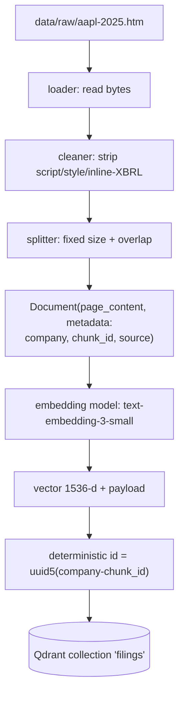
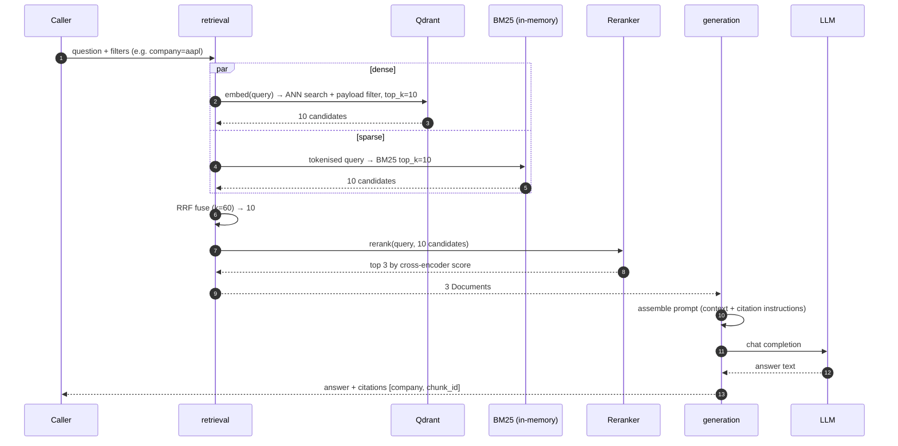
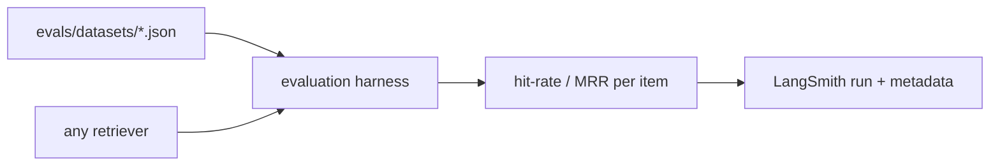

# End-to-End Data Flow

Two distinct paths. Conflating them is the most common architectural mistake in
RAG projects, because it makes the query path carry write-path dependencies.

| Path | Trigger | Latency budget | Runs where |
|---|---|---|---|
| **Indexing (offline)** | A human, on corpus change | Minutes | Batch job / CLI |
| **Query (online)** | A user question | Sub-second to a few seconds | Request handler |

---

## 1. Indexing path (offline, batch)



### What happens at each hop, and what can go wrong

| Hop | Transformation | Failure mode |
|---|---|---|
| Load | bytes → `str` | Missing file, wrong encoding |
| Clean | HTML → plain text | Over-stripping (losing table numbers), under-stripping (XBRL noise in embeddings) |
| Split | text → chunks | Chunk too large (dilutes the embedding), too small (loses context), boundary cuts a fact in half |
| Embed | chunk → vector | Rate limits, cost, silent truncation past the model's token limit |
| Upsert | vector → point | Non-deterministic IDs → duplicates on re-index |

**The chunking hop is where retrieval quality is actually decided.** No
reranker recovers a fact that was split across two chunks.

### Why deterministic point IDs

`uuid5(NAMESPACE_DNS, f"{company}-{chunk_id}")` means re-running indexing
**overwrites** the same points instead of appending near-duplicates. The
alternative (auto-increment or random IDs) makes re-indexing a destructive
operation that requires dropping the collection first — and silently doubles
your corpus if you forget.

The `company` prefix is load-bearing: `chunk_id` restarts at 0 for each filing,
so IDs would collide across companies without it.

---

## 2. Query path (online)



### The candidate-width funnel — why 10 → 10 → 3

```
BM25 top-10  ┐
             ├─ RRF ─→ 10 fused ─→ rerank ─→ top-3 → LLM
dense top-10 ┘
```

Each stage is cheaper-and-dumber than the next:

1. **Retrievers are cheap and imprecise** — so they cast a wide net (10 each).
2. **Fusion is free** — it only reorders.
3. **Reranking is expensive per document** — so it only sees ~10, not 10,000.
4. **The LLM is the most expensive and most context-limited** — so it sees 3.

**The rule that follows:** never slice to the final `top_k` before the
reranker. If the correct chunk sits at fused rank 7 and you cut to 3 first, the
reranker never sees it and no amount of reranking quality helps. Measured on
the previous build: the correct Tesla-energy chunk sat at dense rank 3 and was
absent from BM25's top-20 — retrievers need real headroom above the final `k`.

### Why RRF instead of blending scores

BM25 scores are unbounded (~0–13 here); cosine similarity is ~0–1. Adding them
means the BM25 scale silently dominates, and normalising them requires
corpus-specific tuning that breaks whenever the corpus changes.

Reciprocal Rank Fusion uses only **rank**:

```
score(doc) = Σ over retrievers  1 / (k + rank_in_that_retriever)      # k = 60
```

Rank is scale-free, so RRF works with any retriever — including ones added
later that have no score at all. The constant `k=60` damps the influence of
top-1 results so a single confident retriever cannot dominate the fusion.

**Identity key for fusion:** `(company, chunk_id)`. Using `chunk_id` alone
collides across companies and silently merges Apple's chunk 42 with Tesla's.

---

## 3. Evaluation path



The harness receives a **retriever** and a **dataset**. It does not know
whether it is scoring BM25, dense search, or a five-stage hybrid pipeline. That
ignorance is the whole point: the moment the harness special-cases a strategy,
its numbers stop being comparable across strategies.

---

## 4. Where state lives

| State | Where | Lifetime | Rebuild cost |
|---|---|---|---|
| Raw filings | `data/raw/` (git) | Permanent | — |
| Cleaned text | Nowhere — recomputed | Transient | Seconds |
| Chunks | Nowhere — recomputed | Transient | Seconds |
| Vectors + payloads | Qdrant volume | Until re-index | Embedding cost |
| BM25 index | Process memory | Process lifetime | Seconds (must be built at startup, not per request) |
| Traces | LangSmith | Retention window | — |

Cleaned text and chunks are deliberately **not** cached to disk. They are cheap
to recompute, and a stale cache that disagrees with the vector store is the
kind of bug that costs an afternoon.
