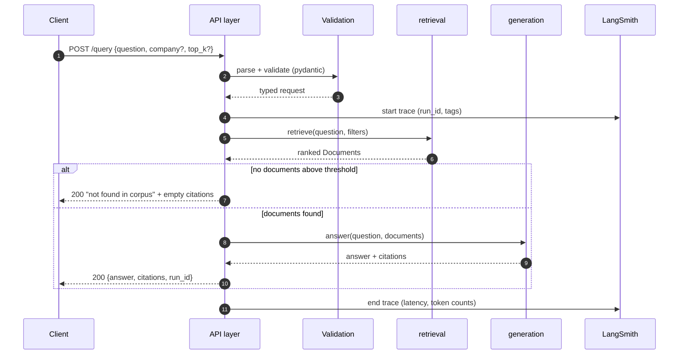

# Request Lifecycle

> **Status:** the serving layer lands in Module 9. This document specifies the
> intended lifecycle now so the modules built before it are shaped to fit — for
> example, deciding *now* that the BM25 index is built at startup rather than
> per request.

---

## 1. Lifecycle of one question



## 2. Phases and their budgets

| Phase | Work | Typical cost | Failure → |
|---|---|---|---|
| **Validate** | Pydantic parse of body; reject unknown company keys | <1 ms | `422` |
| **Embed query** | One OpenAI embedding call | 50–150 ms | `503` (upstream) |
| **Dense search** | Qdrant ANN + payload filter | 5–30 ms | `503` |
| **Sparse search** | In-memory BM25 scoring | 5–50 ms | `500` (our bug) |
| **Fuse** | Pure CPU, no I/O | <1 ms | — |
| **Rerank** | Cross-encoder API over ~10 docs | 100–400 ms | degrade: skip rerank, log it |
| **Generate** | Chat completion over ~3 chunks | 1–4 s | `503` / stream partial |
| **Trace** | Async LangSmith flush | non-blocking | never fails the request |

**The generation call dominates.** Optimising retrieval from 40 ms to 20 ms is
invisible to a user waiting on a 2-second completion. Measure before tuning.

## 3. Startup vs per-request work

This distinction is the difference between a demo and a service.

**At startup (once):**
- Load settings, configure logging, fail fast if a required secret is missing
- Open the Qdrant client (async, connection reused)
- Build the BM25 index from the corpus
- Warm the embedding client

**Per request:**
- Validate, embed the query, search, fuse, rerank, generate

Rebuilding the BM25 index per request would add seconds of CPU to every call —
the classic "it was fine in the eval script" regression, because eval scripts
run the build exactly once and never notice.

## 4. Sync vs async

The read path lives in an event loop and must use the **async** Qdrant client
(`AsyncQdrantClient`). The indexing path is a batch job outside any loop and
uses the sync client.

The failure this prevents: calling a *sync* client inside an `async def`
handler blocks the entire event loop — one slow query stalls every concurrent
request, and the symptom (latency spikes under load, fine in isolation) looks
nothing like the cause.

## 5. Error taxonomy at the boundary

| Condition | Status | Body | Logged as |
|---|---|---|---|
| Malformed request | `422` | validation detail | INFO |
| Unknown company | `400` | allowed values | INFO |
| Qdrant unreachable | `503` | "retrieval unavailable" | ERROR + trace |
| Embedding/LLM rate limit | `429` | retry-after | WARNING |
| Reranker fails | `200` | answer without rerank | WARNING (degraded) |
| Nothing retrieved | `200` | explicit "not in corpus" | INFO |
| Unexpected exception | `500` | opaque message + `run_id` | ERROR + stack |

Two deliberate choices:

- **Reranker failure degrades, it does not fail.** It improves ordering; the
  system is still correct without it.
- **Empty retrieval is a `200`, not a `404`.** "I could not find that in these
  filings" is a *correct answer*, and it is the guardrail against the model
  inventing one. Never let an empty context reach the LLM with a
  "answer the question" instruction.

## 6. What the client gets back

```json
{
  "answer": "Apple reported total net sales of $X billion in FY2025 …",
  "citations": [
    {"company": "aapl", "chunk_id": 153, "source": "aapl-2025.htm", "score": 0.94}
  ],
  "run_id": "a1b2c3d4-…"
}
```

`run_id` is the LangSmith trace ID. It is the single most useful field in the
whole response: a user reports a bad answer, you paste the ID, and you see the
exact retrieved chunks and the exact prompt. Without it, debugging a production
RAG complaint is guesswork.
